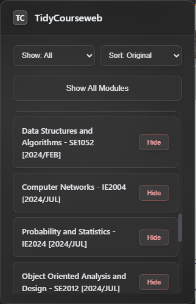

# TidyCourseweb

A clean, modern Chrome extension for SLIIT students that **declutters your Courseweb dashboard**—focus on your current modules, hide past courses, and stay organized in a single click!

---

## Features

- **Hide/Show modules:** Instantly toggle the visibility of any module in your “My Courses” dropdown.
- **Syncs automatically:** Remembers your preferences across devices (using Chrome Sync storage).
- **Powerful popup:** Manage all modules (even hidden ones) from a beautiful popup UI.
- **One-click “Show All”:** Instantly unhide every module if you want a reset.
- **Filter & Sort:** Quickly filter by hidden/visible and sort modules by name.
- **Minimal permissions:** Runs only on your Courseweb, never accesses other sites.

---

## Screenshots

| Popup Controls                          |
| --------------------------------------- |
|  |

---

## Installation

1. **Clone or download** this repository.
2. Go to `chrome://extensions/` in your browser.
3. **Enable “Developer mode”** (toggle in top-right).
4. Click **“Load unpacked”** and select this folder.
5. **Pin TidyCourseweb** for quick access in your toolbar!
6. Open [courseweb.sliit.lk](https://courseweb.sliit.lk), and use the popup or menu toggles to organize your modules.

---

## Usage

- **Hide modules** you don’t want to see in the dropdown—just click “Hide.”
- **Unhide from popup:** Even hidden modules are shown in the popup, where you can “Show” them again.
- **Sort/filter:** Use the popup’s dropdowns to quickly find courses.
- **Show All:** Restore all modules in one click from the popup.

---

## Privacy & Permissions

- **Only** runs on `https://courseweb.sliit.lk/*`.
- Stores your preferences **locally in your Chrome profile**—never sent to any server.
- Required permissions:
  - `storage` (for settings)
  - `host_permissions` for Courseweb only

---

## For Developers

Want to contribute or fork?

- All code is clean, modular JavaScript (MV3).
- Main logic in `/scripts/content.js` and `/popup/popup.js`.
- Icons are in `/icons`.
- PRs and suggestions welcome!

---

## Author

Nayantha Nethsara

---

## License

MIT License — free for academic and personal use.

---

## Questions or Feedback?

- Open a [GitHub Issue](https://github.com/NayanthaNethsara/TidyCourseweb/issues)

---

> **Enjoy a tidier Courseweb and focus on what matters most!**
